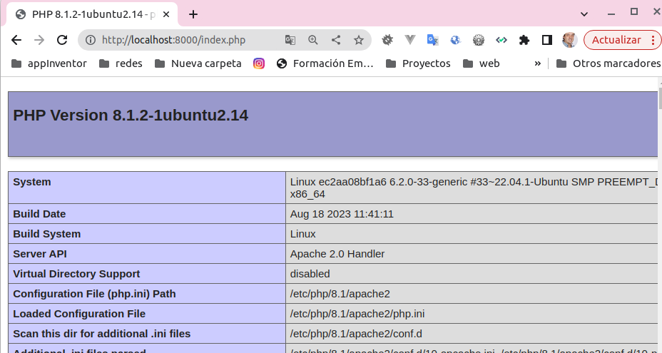

{}
### __:star: Comandos__  
 Repaso de __comandos__ usados en __Dockefiler__
 __Docerfile__ es un fichero de comandos para generar una __imagen__
 {}

{}
####  Crear la imagen a partir del fichero de especificación Dockerfile
> __docker build__ _ubicación_fichero_Dockerfile_
>> Crea una imagen a partir del fichero Dockerfile ubicado en el mismo directorio de dónde lanzo el comando
```bash
docker build -t web:v1 .
```
{}

 * la opción __-t__ permite especificar el nombere de la imagen
 * el punto final __'.'__ especifica la ubicación del fichero __Dockerfile__, el directorio actual
 * Para ver más opciones del comando __build__ ver 
```bash
_docker help build
````

 


{}
####  Especificar la imagen base
> __FROM__
>> Especifica que la imagen sean ubuntu:latest
```dockerfile
FROM ubuntu:latest
```
{}

 * Debe de ser la primera instrucción
 * Su aparición es obligatoria
 * Solo le pueden preceder comentarios __'#'__ y la instrucción __ARG__

 
{}
####  Especificar una instrucción a ejectuar dentro de la imagen
> __RUN__
>> Que se instale  __apache2__, el editor __vim__ y la herramientas para monitoreo de redes __net-tools__ en la imagen
```dockerfile
FROM ubuntu:latest
RUN apt update && apt install -y \
apache2
vim
net-tools
```
{}

 * el && hace que no ejecute la instrucción  de la derecha, hasta que no haya ejecutado la de la izquierda
 * La barra __'\'__ es una forma de seguir en la línea sigueinte como si fuera la misma
 * Se puede ejecutar también un fichero externo que copiemos o cualquier instrucción.
 
 
{}
####  Especificar argumentos 
> __ARG__
>> Establece argumentos para la construcción de la imagen del Dockerfile actual. Establece el tag de la versión como un argumenteo __$version__
```dockerfile
ARG version=latest
FROM ubuntu:$version
RUN echo "Valor de version -$version" version.txt
```
{}

 * El valor de los argumentos especificados con __ARG__ no se mantienen más ayá de la ejecución del fichero __Dockerfile__
 * Se puede modificar el valor de los argumentos a la hora de construir la imagen 
  > __docker build -t web - -build-arg=18:01 .__
 
 
{}
####  Especificando  
> __ARG__
>> Establece argumentos para la construcción de la imagen del Dockerfile actual. Establece el tag de la versión como un argumenteo __$version__
```dockerfile
ARG version=latest
FROM ubuntu:$version
RUN echo "Valor de version -$version" >> version.txt
```

* Al crear la imagen se puede visualizar el contenido del fichero version.txt y ver que no hay valor para la variable
* El operador ">>" lo que hace es dirigir el contenido de la izquierda al fichero, es un operador de direccionameinto.
* Se puede modificar el valor de los argumentos a la hora de construir la imagen
> __docker build -t web - -build-arg=18:01 .__


{}
{}
####  Especificar variables de entorno (disponibles en la construcción y en la imagen cuando se construya)
> __ENV__
>> Establece una variable llamada $user, comprueba que existe en la imagen creada
```dockerfile
ARG version=latest
FROM ubuntu:$version
ENV user=manuel
RUN echo "Valor de usuario -$user" >version.txt
```
* A contunuación creamos el contenedor y vemos el contenido del fichero 
```dockerfile
docker build -t web:v1 .
docker run web:v1 cat version.txt
```
{}

:memo: En este ejemplo, al contenedor le decimos que muestre _el contenido del fichero version.txt_ con el comando __cat__


{}
####  Copiar ficheros del contesto a la imagen
> __COPY__
>> Copia un fichero llamado index.php a una imagen basada en ubuntu:latest, que tenga apache y php
```dockerfile
FROM ubuntu:latest
ARG DEBIAN_FRONTEND=noninteractive
RUN apt update && apt install -y \
    apache2\
    php\
    libapache2-mod-php
COPY index.php /var/www/html/index.php    
```
* El contenido del fichero __index.php__
```php
<?php
phpinfo();
?>
```
* La construcción del contenedor
 ```bash
docker run -d -p 8000:80 --name web web:v1 sh -c "service apache2 start && tail -f /dev/null"
 ```
* Abrimo apache y vemo el index.php


{}

:memo: En este ejemplo, el comando que ejecutamos en el contenedor es __sh -c__" _comando_o_lista_comandos__ "__ 
* El comando para arrancar el servicio __service apache2 start__
* Y para que no se termine el proceso ejectuamos un comando que deja abierto un fichero __tail -f /dev/null__

