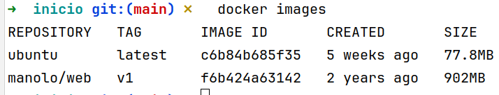
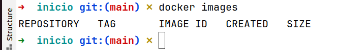
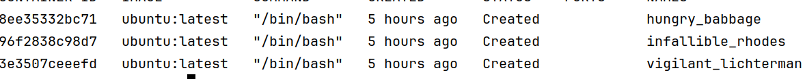

# Práctica con los comandos de docker

## Descargar, ver y borrar imágenes
### Comandos a usar
>```bash
 > docker pull
 > docker images
 > docker rmi 
  ```
* Descarga una imagen llamada ubuntu:latest
 ```bash
  docker pull ubuntu:latest
```
1. Descarga una imagen llamada manolo/web:v1
 ```bash
  docker pull manolo/web:v1
```
2. Verficia que las has descargado listándolas
```bash
  docker images
```
3. Borra la imagen llamada manolo/web:v10



docker rmi manolo/web:v10



```
4. Verifica que la has borrado
```bash
  docker images
```
5. Vuelve a descargar la imagen manolo/web:v10
```bash
  docker pull manolo/web:v1
```

6. Listalas todas
```bash
  docker images
```
 >
7. Borra todas la imágenes
```bash
  docker rmi (docker images)
```
 Si estás en linux
```bash
  docker rmi $(docker images)
```
7. Verifica que las has borrado
```bash
  docker images
```



## Crea, lista y borra contenedores
* Comandos a usar
```bash
 docker create
 docker ps
 docker rm 
 docker rm (docker ps -a -q)
 ```
_Si estás en linux o en mac_
```bash
 docker rm $(docker ps -a -q)
 ```
 Crea 3 contenedores sin especificar nombre a partir de la imagen 
>```bash
   >docker create ubuntu:latest  
   >docker create ubuntu:latest  
   >docker create ubuntu:latest 
 ```
Listalos  y mira el estado en en que los ha creado (tienen que estar en estado __created__)
>```bash
>docker ps -a
 ```

> 
 
 Prueba a borrar uno de ellos
 
 Pruba a borrar todos