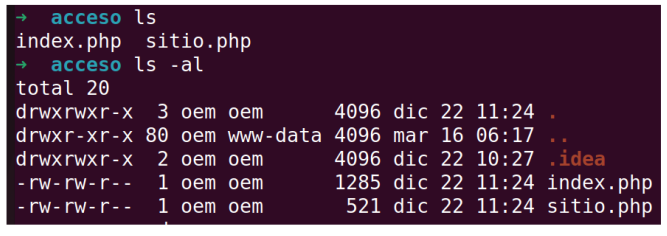

# :page_facing_up: Comandos de ficheros
## ls: Listar archivos y directorios:
Muestra el contenido de la carpeta actual

El comando ls viene de list (list)

```bash
ls
```
Se puede usar con __-l__ para mostrar en formato de listado y __-a__ de all para ver
también los ficheros ocultos. 


Con la opción __-l__ optendremos información de cada fichero/directorio: