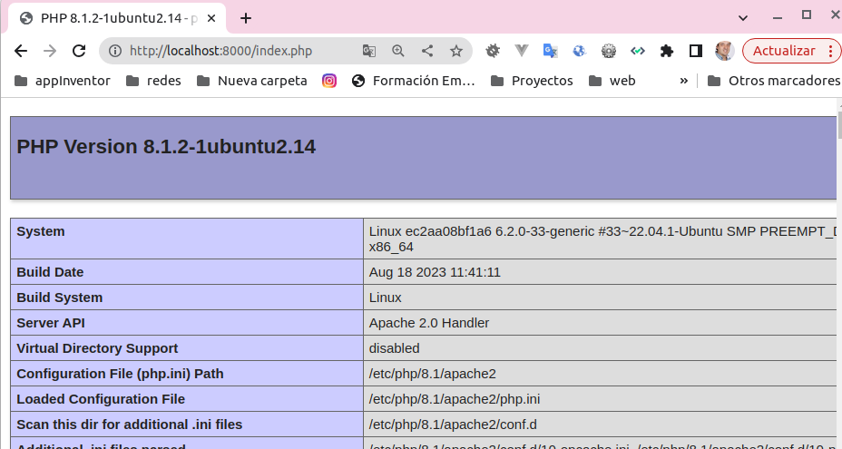
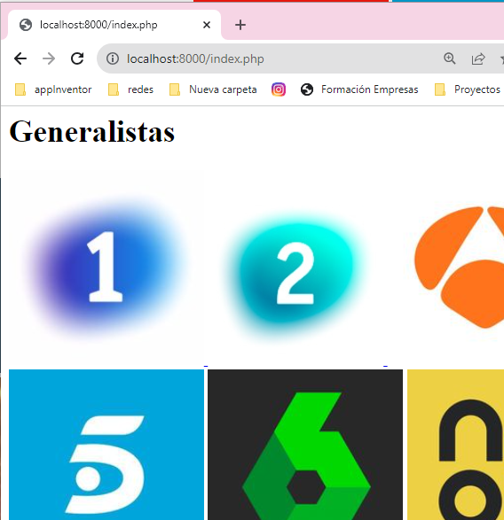

{}
### __:star: Comandos__  
 Repaso de __comandos__ usados en __Dockefiler__
 __Docerfile__ es un fichero de comandos para generar una __imagen__
 {}

{}
####  Crear la imagen a partir del fichero de especificación Dockerfile
> __docker build__ _ubicación_fichero_Dockerfile_
>> Crea una imagen a partir del fichero Dockerfile ubicado en el mismo directorio de dónde lanzo el comando
```bash
docker build -t web:v1 .
```
{}

 * la opción __-t__ permite especificar el nombere de la imagen
 * el punto final __'.'__ especifica la ubicación del fichero __Dockerfile__, el directorio actual
 * Para ver más opciones del comando __build__ ver 
```bash
_docker help build
````

 


{}
####  Especificar la imagen base
> __FROM__
>> Especifica que la imagen sean ubuntu:latest
```dockerfile
FROM ubuntu:latest
```
{}

 * Debe de ser la primera instrucción
 * Su aparición es obligatoria
 * Solo le pueden preceder comentarios __'#'__ y la instrucción __ARG__

 
{}
####  Especificar una instrucción a ejectuar dentro de la imagen
> __RUN__
>> Que se instale  __apache2__, el editor __vim__ y la herramientas para monitoreo de redes __net-tools__ en la imagen
```dockerfile
FROM ubuntu:latest
RUN apt update && apt install -y \
apache2
vim
net-tools
```
{}

 * el && hace que no ejecute la instrucción  de la derecha, hasta que no haya ejecutado la de la izquierda
 * La barra __'\'__ es una forma de seguir en la línea sigueinte como si fuera la misma
 * Se puede ejecutar también un fichero externo que copiemos o cualquier instrucción.
 
 
{}
####  Especificar argumentos 
> __ARG__
>> Establece argumentos para la construcción de la imagen del Dockerfile actual. Establece el tag de la versión como un argumenteo __$version__
```dockerfile
ARG version=latest
FROM ubuntu:$version
RUN echo "Valor de version -$version" version.txt
```
{}

 * El valor de los argumentos especificados con __ARG__ no se mantienen más ayá de la ejecución del fichero __Dockerfile__
 * Se puede modificar el valor de los argumentos a la hora de construir la imagen 
  > __docker build -t web - -build-arg=18:01 .__
 
 
{}
####  Especificando  
> __ARG__
>> Establece argumentos para la construcción de la imagen del Dockerfile actual. Establece el tag de la versión como un argumenteo __$version__
```dockerfile
ARG version=latest
FROM ubuntu:$version
RUN echo "Valor de version -$version" >> version.txt
```

* Al crear la imagen se puede visualizar el contenido del fichero version.txt y ver que no hay valor para la variable
* El operador ">>" lo que hace es dirigir el contenido de la izquierda al fichero, es un operador de direccionameinto.
* Se puede modificar el valor de los argumentos a la hora de construir la imagen
> __docker build -t web - -build-arg=18:01 .__


{}
{}
####  Especificar variables de entorno (disponibles en la construcción y en la imagen cuando se construya)
> __ENV__
>> Establece una variable llamada $user, comprueba que existe en la imagen creada
```dockerfile
ARG version=latest
FROM ubuntu:$version
ENV user=manuel
RUN echo "Valor de usuario -$user" >version.txt
```
* A contunuación creamos el contenedor y vemos el contenido del fichero 
```dockerfile
docker build -t web:v1 .
docker run web:v1 cat version.txt
```
{}

:memo: En este ejemplo, al contenedor le decimos que muestre _el contenido del fichero version.txt_ con el comando __cat__


{}
####  Copiar ficheros del contesto a la imagen
> __COPY__
>> Copia un fichero llamado index.php a una imagen basada en ubuntu:latest, que tenga apache y php
```dockerfile
FROM ubuntu:latest
ARG DEBIAN_FRONTEND=noninteractive
RUN apt update && apt install -y \
    apache2\
    php\
    libapache2-mod-php
COPY index.php /var/www/html/index.php    
```
* El contenido del fichero __index.php__
```php
<?php
phpinfo();
?>
```
* La construcción del contenedor
 ```bash
docker run -d -p 8000:80 --name web web:v1 sh -c "service apache2 start && tail -f /dev/null"
 ```
* Abrimo apache y vemo el index.php


{}

:memo: En este ejemplo, el comando que ejecutamos en el contenedor es __sh -c__" _comando_o_lista_comandos__ "__ 
* El comando para arrancar el servicio __service apache2 start__
* Y para que no se termine el proceso ejectuamos un comando que deja abierto un fichero __tail -f /dev/null__


  {}
####  ADD: Copiar ficheros del contesto a la imagen.
####  CMD ejecuta un comando cuando se inicia el contenedor.
> __ADD__ __CMD__
>> __ADD__ Copia un fichero llamado https://github.com/MAlejandroR/json_tv/blob/main/tv.json en una imagen 
```dockerfile
FROM ubuntu:latest
ARG DEBIAN_FRONTEND=noninteractive
RUN apt update && apt install -y \
    apache2\
    php\
    libapache2-mod-php\
    php-json
ADD https://raw.githubusercontent.com/MAlejandroR/json_tv/main/tv.json  /var/www/html/tv.json
COPY index.php /var/www/html
RUN chmod 775 /var/www/html/*
CMD sh -c "service apache2 start && tail -f /dev/null"
```
* El contenido del fichero __index.php__
```php
<?php
$tv = file_get_contents("tv.json");
$cadenas = json_decode($tv, true);
foreach ($cadenas as $cadena) {
    echo "<h1>{$cadena['name']}</h1>";
    foreach ($cadena['channels'] as $canal){
        echo "
        <a href='{$canal['web']}'>
            
        </a>";
    }
    echo "<hr style='background-color:green;height:10px' />";
}
?>
```
* La construcción del contenedor
 ```bash
docker run -d -p 8000:80 --name web web:v1 
 ```
* Solicitamos el recurso en un navegador y vemos el resultado    
  
{}

:memo: En este ejemplo es un poco complicado, comentamos
* Recupero el fichero que hay en la web __tv.json__
* Tengo que instalar una extensión de php (__phgp-json__) para leer su contenido que es un __json__.
* Tengo que dar __permisos__ para que apache pueda leer su contendio
* Cuidado con las barras si quiero especificar __"./tv.js"__ vs __".\tv.js"__
* :smile:El código de php ya lo realizaremos cuando empecemos con ese tema :smile:
* No tenemos que especificar ningún comando para que se ejecute el contenedor
* El __-d__ es para especificar que se ejecute el contenedor en background.
  
  

{}
####  Especificar el puerto que voy a mapear o realizar el forware
> __EXPOSE__
>> Establece que vas a realizar un forwar sobre el puerto 80
```dockerfile
FROM ubuntu:latest
ARG DEBIAN_FRONTEND=noninteractive
RUN apt update && apt install -y \
    apache2\
    php\
    libapache2-mod-php\
    php-json
ADD https://raw.githubusercontent.com/MAlejandroR/json_tv/main/tv.json  /var/www/html/tv.json
COPY index.php /var/www/html
RUN chmod 775 /var/www/html/*
EXPOSE 80
CMD sh -c "service apache2 start && tail -f /dev/null"
```
{}

* Uso el mismo ejemplo anterior especicando que voy a compartir el puerto 80
* Este comando es informativo, no obliga a nada ni por ponerlo se comparte el puertoç
* Es recomendado en las buenas prácticas
> __docker build -t web - -build-arg=18:01 .__


{}
####  Crear etiquetas en la imagen
> __LABEL__
>> Añade 3 etiquetas, tu identificación _maintainer_ _description_ _version_ 
```dockerfile
FROM ubuntu:latest
ARG DEBIAN_FRONTEND=noninteractive
LABEL maintainer="manuel Romero <manuelromeromiguel@gmail.com>"
LABEL description="Imagen de contenedor con Apache, PHP y un archivo JSON"
LABEL version="1.0"
RUN apt update && apt install -y \
    apache2\
    php\
    libapache2-mod-php\
    php-json
ADD https://raw.githubusercontent.com/MAlejandroR/json_tv/main/tv.json  /var/www/html/tv.json
COPY index.php /var/www/html
RUN chmod 775 /var/www/html/*
EXPOSE 80
CMD sh -c "service apache2 start && tail -f /dev/null"
```
{}

* Puedes crear tus propias etiquetas.
* __maintainer, description, version__ se usan de forma estándar. 
> __docker build -t web - -build-arg=18:01 .__

 
